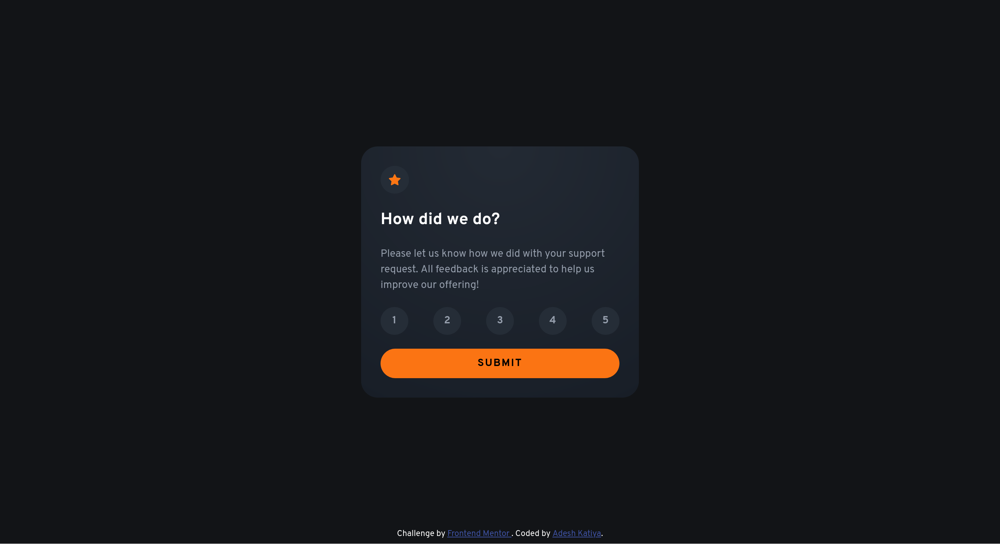

# Frontend Mentor - Interactive rating component solution

This is a solution to the [Interactive rating component challenge on Frontend Mentor](https://www.frontendmentor.io/challenges/interactive-rating-component-koxpeBUmI). Frontend Mentor challenges help you improve your coding skills by building realistic projects.

## Table of contents

- [Overview](#overview)
  - [The challenge](#the-challenge)
  - [Screenshot](#screenshot)
  - [Links](#links)
- [My process](#my-process)
  - [Built with](#built-with)
  - [What I learned](#what-i-learned)
  - [Continued development](#continued-development)
  - [Useful resources](#useful-resources)

## Overview

### The challenge

Users should be able to:

- View the optimal layout for the app depending on their device's screen size
- See hover states for all interactive elements on the page
- Select and submit a number rating
- See the "Thank you" card state after submitting a rating

### Screenshot

### Links

- Solution URL: [Interactive Rating component](https://www.frontendmentor.io/solutions/interactive-rating-component-built-with-semantic-html-and-a11y-feature-lUyPL7O_t2)
- Live Site URL: [Interactive Rating component](https://fem-interactive-rating-component-chi.vercel.app/)

## My process

### Built with

- Semantic HTML5 markup
- CSS custom properties
- Flexbox
- Mobile-first workflow
- [Vite](https://vite.dev/guide/) - Build tool

### What I learned

- Including accessibility features like keyboard navigation, aria-attributes etc.

### Useful resources

- [a11y project](https://www.a11yproject.com/) - This helped me for finding best practices for developing accessible elements.
